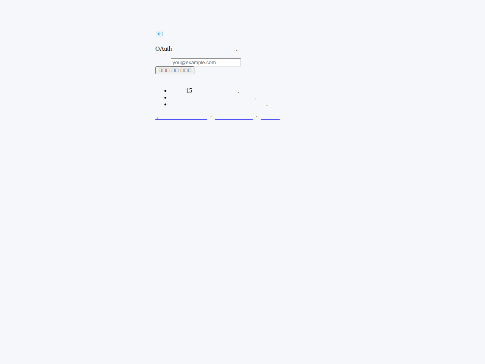

# 비상 접근 가이드

OAuth 정상화 전에도 운영자가 admin 패널과 가격 룰 페이지에 진입할 수 있도록 Magic Link와 Bootstrap 토큰을 제공합니다.

## 1. Magic Link 사용법



1. `/auth/magic-link` 접속
2. 관리자 이메일 입력
3. 받은 메일의 1회용 링크 클릭
4. `/auth/whoami` 에서 `user_role=admin` 확인

### 보안 메모
- 링크는 15분 동안만 유효합니다.
- 한 번 사용하면 재사용할 수 없습니다.
- 본인이 요청하지 않았다면 메일을 무시하세요.

## 2. Bootstrap 토큰 사용법

가장 빠른 우회 경로:

```text
/auth/bootstrap?token=<ADMIN_BOOTSTRAP_TOKEN>&email=<ADMIN_EMAIL>
```

조건:
- `ADMIN_BOOTSTRAP_TOKEN` 환경변수 설정
- `ADMIN_EMAILS` 에 관리자 이메일 등록
- HTTPS 환경에서만 사용 권장

## 3. 운영 보안 권고

- OAuth 정상화 후 `ADMIN_BOOTSTRAP_TOKEN` 삭제
- `/admin/diagnostics` 에서 Bootstrap 설정 상태 확인
- 실패 로그가 반복되면 토큰 재발급 및 세션 만료 처리
