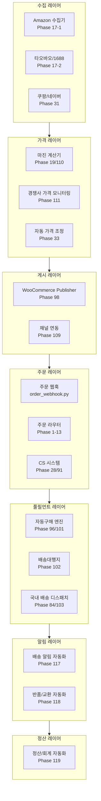
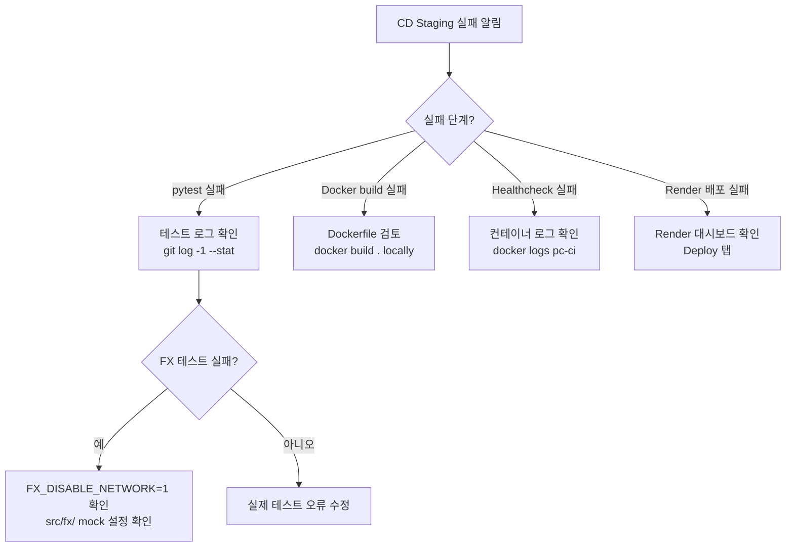

# 운영 RUNBOOK — proxy-commerce

> **난이도**: 당나귀도 한 번 읽으면 따라할 수 있도록 매우 상세하게 작성  
> **최종 업데이트**: 2026-05-02 (Phase 120)

---

## 목차

1. [시스템 아키텍처 한눈에](#1-시스템-아키텍처)
2. [Phase별 모듈 책임 표](#2-phase별-모듈-책임-표)
3. [일일 체크리스트 (5분)](#3-일일-체크리스트)
4. [주간 체크리스트](#4-주간-체크리스트)
5. [월간 체크리스트](#5-월간-체크리스트)
6. [장애 대응 플레이북](#6-장애-대응-플레이북)
7. [시크릿 회전 절차](#7-시크릿-회전-절차)
8. [백업 / 복원 절차](#8-백업--복원-절차)

---

## 1. 시스템 아키텍처



---

## 2. Phase별 모듈 책임 표

| Phase | 모듈 | 주요 책임 | 봇 커맨드 | API 엔드포인트 |
|-------|------|----------|----------|---------------|
| 1–13 | `src/orders/`, `src/fx/`, `src/inventory/` | 핵심 주문/환율/재고 | `/status`, `/fx` | `/health`, `/webhook/*` |
| 17–18 | `collectors/` | Amazon/타오바오 수집 | `/collect` | `/api/v1/collectors/*` |
| 19 | `src/fx/` | 환율 갱신 | `/fx update` | `/api/v1/fx/*` |
| 25 | `src/dashboard/` | 관리자 패널 | — | `/admin/*` |
| 27 | `src/shipping/` | 배송 추적 | `/track` | `/api/v1/tracking/*` |
| 28 | `src/cs/` | CS 티켓 | `/cs list` | `/api/v1/cs/*` |
| 37 | `src/returns/` | 반품/교환/환불 계산 | `/return` | `/api/v1/returns/*` |
| 84 | `src/fulfillment_automation/` | 국내 배송 디스패치 | `/dispatch` | `/api/v1/fulfillment/*` |
| 96/101 | `src/auto_purchase/` | 자동구매 엔진 | `/purchase` | `/api/v1/auto-purchase/*` |
| 102 | `src/forwarding/` | 배송대행지 연동 | `/forward` | `/api/v1/forwarding/*` |
| 103 | `src/fulfillment/` | 국내 풀필먼트 | `/fulfill` | `/api/v1/fulfillment-ops/*` |
| 117 | `src/delivery_notifications/` | 배송 상태 알림 | `/notify_status` | `/api/v1/delivery-notifications/*` |
| 118 | `src/returns_automation/` | 반품/교환 자동화 | `/returns list` | `/api/v1/returns-automation/*` |
| 119 | `src/finance_accounting/` | 정산/회계 | `/finance_close` | `/api/v1/finance/*` |

---

## 3. 일일 체크리스트

> 매일 아침 5분 점검. 이상 없으면 OK.

### 3-1. 서비스 헬스 확인

```bash
# Render 서비스 헬스체크
curl -sf https://kohganepercentiii.com/health | python3 -m json.tool

# 상세 헬스체크
curl -sf https://kohganepercentiii.com/health/deep | python3 -m json.tool
```

예상 응답:
```json
{"status": "ok", "timestamp": "...", "version": "..."}
```

### 3-2. 정산 일일 마감

```
텔레그램 봇에서: /finance_close daily
```

또는 API:
```bash
curl -X POST https://kohganepercentiii.com/api/v1/finance/close/daily \
  -H "Authorization: Bearer $JWT_TOKEN"
```

### 3-3. 이상 거래 확인

```
텔레그램 봇에서: /finance anomalies
```

Phase 119 이상거래 감지기가 다음을 체크합니다:
- 음수 마진 주문
- 환율 손실 초과
- 정산 누락 주문
- 중복 결제
- 금액 불일치

### 3-4. 미처리 반품 확인

```
텔레그램 봇에서: /returns pending
```

### 3-5. 배송 지연 알림 확인

```
텔레그램 봇에서: /notify_status delays
```

48시간 초과 배송이 있으면 자동 알림이 이미 발송됨.

---

## 4. 주간 체크리스트

> 매주 월요일 (10분)

### 4-1. 주간 정산 마감

```
/finance_close weekly
```

### 4-2. 정산 배치 확정

```bash
curl -X POST https://kohganepercentiii.com/api/v1/finance/close/weekly \
  -H "Authorization: Bearer $JWT_TOKEN"
```

### 4-3. 보안 감사

```bash
# 의존성 취약점 점검
pip audit

# 또는 GitHub Actions > dependency_audit.yml 수동 트리거
```

### 4-4. 로그 검토

Render 대시보드 → **Logs** 탭에서 지난 7일 ERROR/CRITICAL 로그 검색:

```
level:error OR level:critical
```

---

## 5. 월간 체크리스트

> 매월 1일 (30분)

### 5-1. 월간 정산 마감

```
/finance_close monthly
```

### 5-2. 세무 리포트 export

```bash
# CSV 형식
curl "https://kohganepercentiii.com/api/v1/finance/tax-report?year=2026&month=5&format=csv" \
  -H "Authorization: Bearer $JWT_TOKEN" \
  -o tax_report_2026_05.csv

# JSON 형식
curl "https://kohganepercentiii.com/api/v1/finance/tax-report?year=2026&month=5&format=json" \
  -H "Authorization: Bearer $JWT_TOKEN" \
  -o tax_report_2026_05.json
```

### 5-3. 백업 검증

```bash
python scripts/migrate.py --verify-backup
```

### 5-4. 의존성 audit

```bash
pip install pip-audit
pip-audit -r requirements.txt
```

---

## 6. 장애 대응 플레이북

### 6-1. CD Staging 실패 트리아지



**FX 테스트 실패 대응**:
```bash
# 로컬에서 재현
FX_DISABLE_NETWORK=1 python -m pytest tests/test_fx.py -v
```

**컨테이너 부팅 실패 대응**:
```bash
# 로컬에서 동일 환경으로 실행
docker build -t pc-local .
docker run -p 10000:10000 -e PORT=10000 -e FX_DISABLE_NETWORK=1 pc-local
curl http://localhost:10000/health
```

---

### 6-2. Render OOM / Cold Start 대응

**증상**: 502 오류, 응답 없음, Render 로그에 `OOM Killed` 또는 오랜 첫 응답

**Cold Start 대응** (Render Free tier 15분 비활성 슬립):
1. Render 대시보드 → **Settings** → **Health & Alerts**에서 헬스체크 확인
2. 외부 Uptime 모니터 설정 (UptimeRobot 무료 플랜으로 10분마다 `/health` 호출)

```bash
# UptimeRobot 대신 GitHub Actions cron으로 ping
# .github/workflows/keep_alive.yml (별도 생성 가능)
```

**OOM 대응**:
1. Render 대시보드 → **Metrics** → Memory 사용량 확인
2. `GUNICORN_WORKERS` 를 `1` 로 줄이기
3. 또는 Render Starter 플랜($7/월) 으로 업그레이드

---

### 6-3. 데이터 정합성 이상

Phase 119 `anomaly_detector`에서 알림 도착 시:

```
텔레그램: ⚠️ [anomaly] 음수 마진 주문 감지 ...
```

1. 봇 커맨드로 상세 확인:
   ```
   /finance anomalies
   ```
2. 해당 주문 ID로 수동 검토:
   ```bash
   curl "https://kohganepercentiii.com/api/v1/finance/ledger?order_id=<ID>" \
     -H "Authorization: Bearer $JWT_TOKEN"
   ```
3. 필요 시 수동 조정 후 원장 잠금:
   ```bash
   curl -X POST "https://kohganepercentiii.com/api/v1/finance/close/daily" \
     -H "Authorization: Bearer $JWT_TOKEN"
   ```

---

## 7. 시크릿 회전 절차

> 시크릿은 90일마다 또는 노출 의심 즉시 회전

### Telegram Bot Token 회전

1. `@BotFather` 에게 `/revoke` → 새 토큰 발급
2. Render 대시보드 → **Environment** → `TELEGRAM_BOT_TOKEN` 값 업데이트
3. **Save Changes** → 자동 재배포 트리거

### WooCommerce API Key 회전

1. WooCommerce 관리자 → **Settings** → **Advanced** → **REST API**
2. 기존 키 **Revoke** → 새 키 생성
3. Render에서 `WOO_CK`, `WOO_CS` 업데이트

### JWT Secret 회전

1. 새 랜덤 시크릿 생성:
   ```bash
   python3 -c "import secrets; print(secrets.token_hex(32))"
   ```
2. Render에서 `JWT_SECRET_KEY` 업데이트
3. ⚠️ 기존 발급된 JWT 토큰이 모두 무효화됨 — 사용자 재로그인 필요

---

## 8. 백업 / 복원

> Phase 61에서 구현된 백업 시스템 사용

### 수동 백업

```bash
python scripts/migrate.py --export > backup_$(date +%Y%m%d).json
```

### 백업 복원

```bash
python scripts/migrate.py --import backup_20260501.json
```

### Google Sheets 백업 확인

Phase 1–13에서 주문/재고/환율 데이터가 Google Sheets에 영속됩니다.

```bash
# 스프레드시트 ID 확인
echo $GOOGLE_SHEET_ID
# Google Drive에서 직접 접근하여 확인
```
