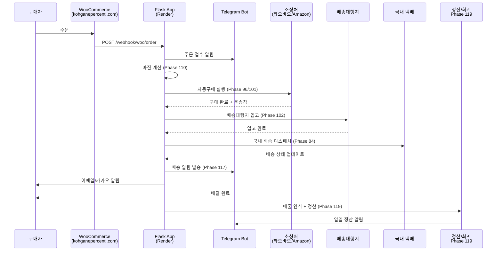

# 시스템 전체 개요 (SYSTEM_OVERVIEW.md)

> Phase 1 → 119 한 페이지 요약  
> **최종 업데이트**: 2026-05-02 (Phase 120)

---

## Phase 전체 요약 테이블

| Phase | 이름 | 핵심 한 줄 요약 | 상태 |
|-------|------|----------------|------|
| 1–13 | 기본 시스템 | 봇·API·환율·배송·주문·재고·감사·캐시·알림 기반 구축 | ✅ |
| 14 | 리뷰/CRM | 리뷰 관리 + 프로모션 + CRM | ✅ |
| 15 | 마케팅 자동화 | 마케팅 자동화 + SEO + 통합 웹훅 허브 | ✅ |
| 16 | 경쟁사 분석 | 가격 인텔리전스 + 재고 예측 + 워크플로 자동화 | ✅ |
| 17 | 상품 수집 | Amazon US/JP + 타오바오/1688 수집기 | ✅ |
| 18 | 상품 편집 | 상세 페이지 에디터 | ✅ |
| 19 | 환율 + 마진 | 실시간 환율 확장 + 마진 계산기 | ✅ |
| 20 | Dashboard Web UI | 대시보드 + CD 워크플로 | ✅ |
| 21 | 텔레그램 강화 | 주문 알림 + 인라인 버튼 | ✅ |
| 22 | 결제/정산 | 토스페이먼츠 + 수수료 계산 | ✅ |
| 23 | 모니터링 | Prometheus + Grafana | ✅ |
| 24 | Auth | JWT + Google/Kakao OAuth2 | ✅ |
| 25 | 관리자 패널 | Jinja2 + Bootstrap 5 (`/admin/`) | ✅ |
| 26 | 성능 최적화 | 캐시 전략 + 비동기 큐 | ✅ |
| 27 | 배송 추적 | 택배사 연동 + 상태 알림 | ✅ |
| 28 | CS 시스템 | 티켓 + 자동 응답 + SLA | ✅ |
| 29 | 데이터 분석 | RFM + ABC 분류 | ✅ |
| 30 | CI/CD | 의존성 감사 + 자동 릴리스 | ✅ |
| 31 | 멀티채널 재고 | 쿠팡/네이버/자체몰 재고 동기화 | ✅ |
| 32 | 번역 | EN/JA/ZH → KO 상품 번역 파이프라인 | ✅ |
| 33 | 자동 가격 조정 | 마진/경쟁가/수요 기반 엔진 | ✅ |
| 34 | 공급업체 관리 | CRUD + 스코어링 + 발주서 | ✅ |
| 35 | 알림 허브 | 텔레그램+이메일+Slack 다채널 | ✅ |
| 36 | E2E 테스트 | 통합 테스트 + E2E | ✅ |
| 37 | 반품/교환 | 환불 계산 + 검수 A~D | ✅ |
| 38–48 | 부가 기능 | 쿠폰·프로모션·태그·배치·감사·마이그레이션·위시리스트·번들·통화·이미지·유저프로필 | ✅ |
| 49–60 | 엔터프라이즈 | 멀티테넌시·A/B테스트·웹훅·API문서·로깅·벤치마크·파일스토리지 | ✅ |
| 61–80 | 고도화 | 백업·보안·알림·스케줄러·인사이트·플러그인·리포트·워크플로·동기화 | ✅ |
| 81 | 프로덕션 안정화 | 멀티리전·장애복구·SLA | ✅ |
| 82 | 자동구매 엔진 | 주문 트리거 → 타오바오/Amazon 자동 구매 | ✅ |
| 83 | 배송대행지 재구현 | 포워딩 창고 연동 v2 | ✅ |
| 84 | 국내 배송 디스패치 | CJ/한진/롯데 송장 자동 등록 | ✅ |
| 85–95 | 확장 기능 | mobile API·채널관리·PG·B2B·상품피드·실시간분석 | ✅ |
| 96 | 자동구매 v2 | CD Staging + 자동구매 고도화 | ✅ |
| 97–103 | 물류 자동화 | 물류비·채널·풀필먼트·배송대행지·풀필먼트ops | ✅ |
| 104–116 | 운영 고도화 | 차이나마켓·예외처리·자율운영·채팅·소싱모니터·채널연동·마진강화·경쟁가·매칭·가상재고·셀러리포트·소싱발굴·보안 | ✅ |
| 117 | 배송 알림 자동화 | 배송 상태 변화 감지 → 다국어 텔레그램/이메일 자동 발송 | ✅ |
| 118 | 반품/교환 자동화 | 요청 접수→자동분류→승인→회수→검수→환불/교환 전 자동화 | ✅ |
| 119 | 정산/회계 자동화 | 매출·매입·FX손익·복식부기·이상거래감지·세무리포트 | ✅ |
| **120** | **배포 파이프라인 + 운영 문서화** | **Render+Cloudflare 자동화 + RUNBOOK + 안정화 문서** | ✅ |

---

## 데이터 플로우 시퀀스 다이어그램

---

## 외부 의존성 표

| 서비스 | 용도 | 환경변수 | 비고 |
|--------|------|----------|------|
| **Telegram** | 봇 알림 + 운영자 커맨드 | `TELEGRAM_BOT_TOKEN`, `TELEGRAM_CHAT_ID` | BotFather에서 발급 |
| **WooCommerce** | 메인 쇼핑몰 (주문/상품) | `WOO_BASE_URL`, `WOO_CK`, `WOO_CS` | kohganepercenti.com |
| **Amazon SP-API** | 상품 수집 (US/JP) | `AMAZON_SP_*` | SP-API 계정 필요 |
| **타오바오/1688** | 소싱처 (중국) | — (스크래핑) | IP 차단 주의 |
| **쿠팡** | 판매 채널 | `COUPANG_ACCESS_KEY`, `COUPANG_SECRET_KEY` | 쿠팡 파트너스 |
| **네이버 스마트스토어** | 판매 채널 | `NAVER_CLIENT_ID`, `NAVER_CLIENT_SECRET` | 네이버 커머스 API |
| **Google Sheets** | 데이터 영속 (주문/재고/환율) | `GOOGLE_SERVICE_JSON_B64`, `GOOGLE_SHEET_ID` | Service Account |
| **Render** | 호스팅 (Web Service, Docker) | `RENDER_API_TOKEN` | srv-d78d5rfkijhs73868f8g |
| **Cloudflare** | DNS + CDN + WAF | `CF_API_TOKEN` | kohganepercenti.com |
| **FX Provider** | 환율 (exchangerate-api / frankfurter) | — | `FX_DISABLE_NETWORK=1` 로 mock 가능 |
| **토스페이먼츠** | PG (결제/환불) | `TOSS_CLIENT_KEY`, `TOSS_SECRET_KEY` | Phase 22 |
| **Shopify** | 보조 판매 채널 | `SHOPIFY_SHOP`, `SHOPIFY_ACCESS_TOKEN` | 선택적 사용 |
